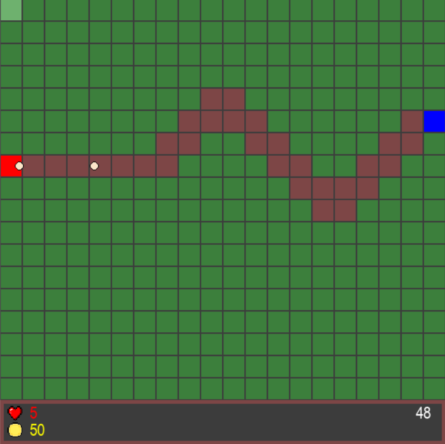
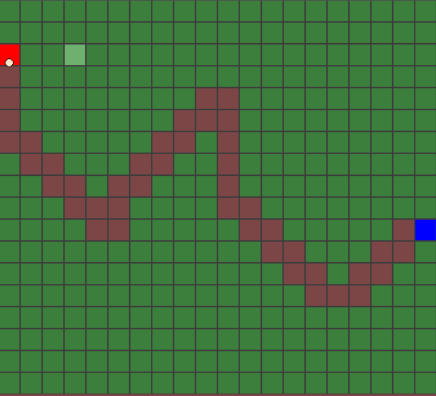
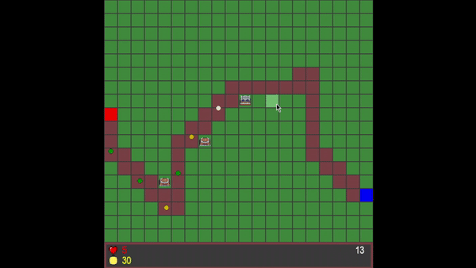
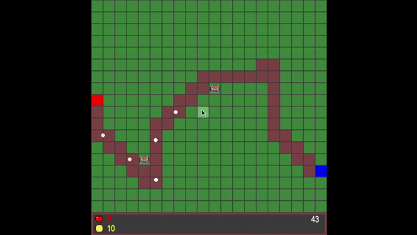
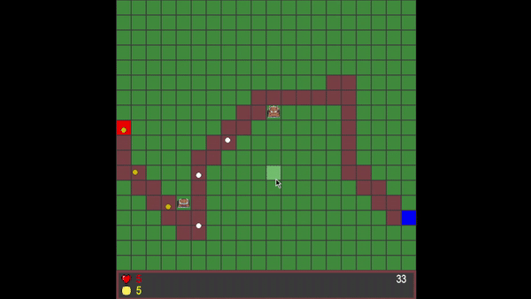
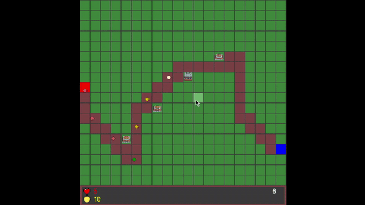
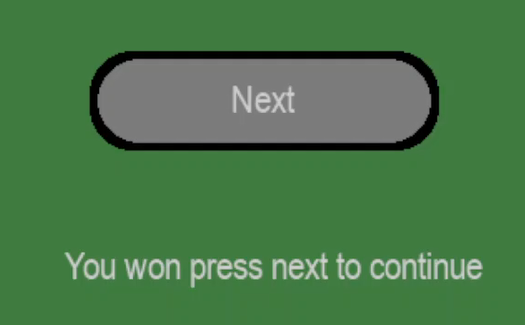
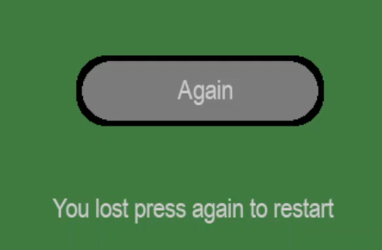

# pyTowerDefence:
Simple TD game created with pycharm

## Documentation:
Documentation with functions descriptions is found in [docs/dcoumentation.md](docs/documentation.md)

## Features:
### Auto generated road for enemies
Road is generated randomly at each round 0_0

Example 1:

Example 2:

### Ability to place towers
You can place towers wherever u want :D
(Better to place near road)

### Ability to upgrade towers:
Here some examples of upgraded tower

Lvl1:

Lvl3:

Lvl6:

### GameWin screen:
Wow, you won, now play next round

### GameOver screen:
Wow, game over screen with not centered text, amazing

## Dla K.K.:
Cały kod napisałem sam, z internetu wziąłem tylko zdjęcia wież i dźwieki
